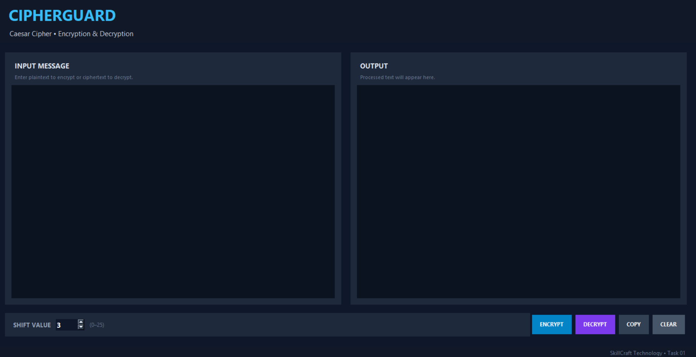
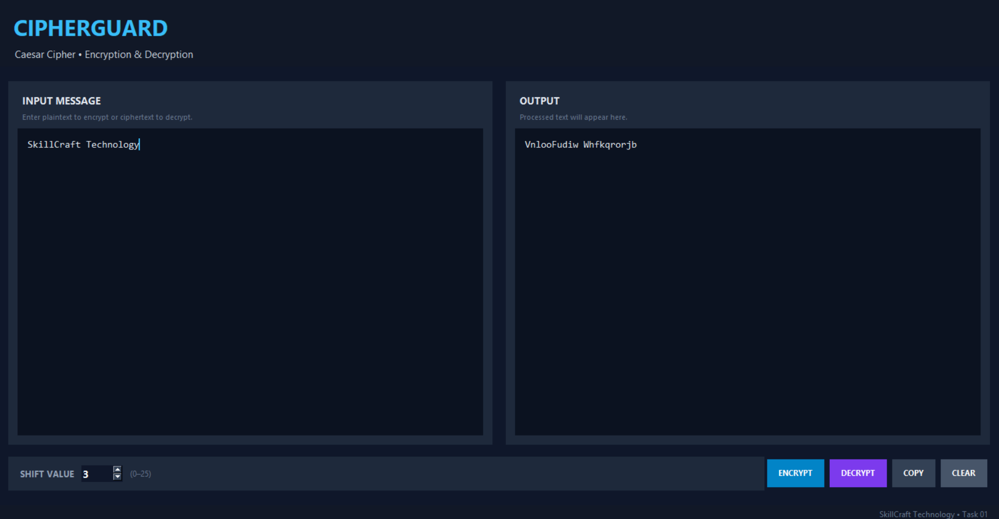
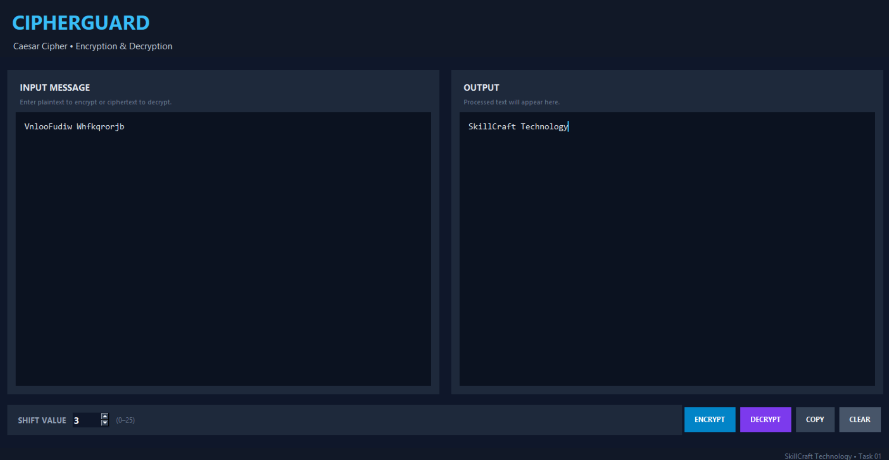

# CipherGuard – Caesar Cipher Application

## SkillCraft Technology Internship – Task 01

### Objective
Develop a user-friendly application that encrypts and decrypts text using the Caesar Cipher algorithm.

### Features
- GUI-based application
- Encrypt text using a user-selected shift value
- Decrypt encrypted text
- Supports uppercase and lowercase letters
- Preserves spaces, numbers, and special characters
- Copy output to clipboard
- Clear/reset controls
- Status indicator
- Dark cybersecurity-themed interface

### Technology
- Python 3
- Tkinter (Python standard GUI library)

### How to Run
Make sure Python 3 is installed.

```bash
python caesar_cipher.py
```

On Windows, you may also use:

```bash
py caesar_cipher.py
```

### Example
Input:
```text
Hello World
```

Shift:
```text
3
```

Encrypted:
```text
Khoor Zruog
```

Decrypting `Khoor Zruog` with shift `3` returns:
```text
Hello World
```

### Project Structure

```text
SCT_CS_01/
├── caesar_cipher.py
├── README.md
├── 01_ciphertool_ui..png
├── 02_encryption_demo..png
└── 03_decryption_demo..png
```

## Screenshots

### Application Interface


### Encryption Demo


### Decryption Demo


## How It Works

The application uses the Caesar Cipher technique to shift alphabetic characters by a user-defined value.

- **Encryption:** Each letter is shifted forward by the selected shift value.
- **Decryption:** Each letter is shifted backward by the selected shift value.
- Uppercase and lowercase letters are handled separately.
- Spaces, numbers, and special characters remain unchanged.
- The shift wraps around the alphabet using modulo 26.
  
  ## Learning Outcomes

Through this project, I gained practical experience in:

- Python programming
- Tkinter GUI development
- Caesar Cipher and classical cryptography
- Encryption and decryption logic
- Modular arithmetic
- Event-driven programming
- Designing a user-friendly desktop application
  
 ## Technologies Used

- Python 3
- Tkinter
- Classical Cryptography


### Note
Caesar Cipher is a classical educational cipher and should not be used for protecting sensitive real-world information.
# SCT_CS_01
Caesar Cipher encryption and decryption application developed using Python and Tkinter for SkillCraft Technology Internship Task 01.
